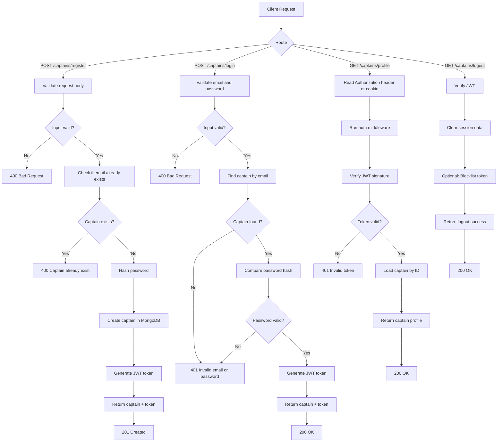

# Captain API Documentation

## Overview

The Captain API provides endpoints for captain registration and authentication. Captains are drivers who operate vehicles for the ride-sharing platform. This documentation covers all available captain endpoints and their usage.

## Base URL

```
http://localhost:4000/captains
```

---

## Captain Registration Endpoint

### POST /captains/register

Creates a new captain account with personal and vehicle information.

#### Description

Registers a new captain with full name, email, password, and vehicle details. The request is validated before saving. If valid, the server stores the captain and returns a JWT token.

#### Request Method

`POST`

#### Required Request Body

The request body must be a JSON object in the following format:

```json
{
  "fullname": {
    "firstname": "Rajesh",
    "lastname": "Kumar"
  },
  "email": "rajesh.captain@example.com",
  "password": "Captain@123",
  "vehicle": {
    "color": "Black",
    "numberplate": "MH02AB1234",
    "capacity": 4,
    "vehicalType": "car"
  }
}
```

#### Validation Rules

- `fullname.firstname`: required, minimum 3 characters
- `fullname.lastname`: optional, minimum 2 characters
- `email`: required, must be a valid email address, must be unique
- `password`: required, minimum 6 characters
- `vehicle.color`: required, minimum 3 characters
- `vehicle.numberplate`: required, minimum 4 characters
- `vehicle.capacity`: required, must be an integer ≥ 1
- `vehicle.vehicalType`: required, must be one of: `car`, `bike`, `van`, `auto`

#### Example Request

```bash
curl -X POST http://localhost:4000/captains/register \
  -H "Content-Type: application/json" \
  -d '{
    "fullname": {
      "firstname": "Rajesh",
      "lastname": "Kumar"
    },
    "email": "rajesh.captain@example.com",
    "password": "Captain@123",
    "vehicle": {
      "color": "Black",
      "numberplate": "MH02AB1234",
      "capacity": 4,
      "vehicalType": "car"
    }
  }'
```

#### Success Response

**Status Code:** `201 Created`

**Response Body:**

```json
{
  "captain": {
    "_id": "64a7b2d9f1c2d3e4f5a6b7c9",
    "fullname": {
      "firstname": "Rajesh",
      "lastname": "Kumar"
    },
    "email": "rajesh.captain@example.com",
    "vehicle": {
      "color": "Black",
      "numberplate": "MH02AB1234",
      "capacity": 4,
      "vehicalType": "car"
    },
    "status": "active"
  },
  "token": "eyJhbGciOiJIUzI1NiIsInR5cCI6IkpXVCJ9.eyJfaWQiOiI2NGE3YjJkOWYxYzJkM2U0ZjVhNmI3YzkiLCJpYXQiOjE2ODg1NTU1NTUsImV4cCI6MTY4ODY0MTk1NX0.abc123..."
}
```

#### Validation Error Response

**Status Code:** `400 Bad Request`

**Response Body:**

```json
{
  "errors": [
    {
      "msg": "Name is required",
      "param": "fullname.firstname",
      "location": "body"
    },
    {
      "msg": "Valid email is required",
      "param": "email",
      "location": "body"
    }
  ]
}
```

#### Duplicate Email Response

**Status Code:** `400 Bad Request`

**Response Body:**

```json
{
  "message": "Captain already exist"
}
```

#### Server Error Response

**Status Code:** `500 Internal Server Error`

**Response Body:**

```json
{
  "message": "Error message describing the issue"
}
```

#### Status Codes Summary

| Code | Description |
| ---- | ----------- |
| 201  | Captain successfully created |
| 400  | Invalid input, validation failed, or captain already exists |
| 500  | Server error while creating the captain |

#### Notes

- The password is hashed using bcrypt before being saved to the database
- A JWT token is generated for the newly created captain with a 24-hour expiration
- The email must be unique; attempting to register with an existing email will return a 400 error
- The token should be stored by the client and sent in subsequent requests that require authentication
- Captain status defaults to "active"

---

## Captain Login Endpoint (Commented Out)

### POST /captains/login

> **Note:** This endpoint is currently commented out in the route file. Uncomment to enable.

Authenticates an existing captain by checking the email and password.

#### Request Method

`POST`

#### Required Request Body

```json
{
  "email": "rajesh.captain@example.com",
  "password": "Captain@123"
}
```

#### Expected Response (when enabled)

**Status Code:** `200 OK`

```json
{
  "captain": {
    "_id": "64a7b2d9f1c2d3e4f5a6b7c9",
    "fullname": {
      "firstname": "Rajesh",
      "lastname": "Kumar"
    },
    "email": "rajesh.captain@example.com",
    "vehicle": {
      "color": "Black",
      "numberplate": "MH02AB1234",
      "capacity": 4,
      "vehicalType": "car"
    },
    "status": "active"
  },
  "token": "eyJhbGciOiJIUzI1NiIsInR5cCI6IkpXVCJ9..."
}
```

---

## Captain Profile Endpoint (Commented Out)

### GET /captains/profile

> **Note:** This endpoint is currently commented out in the route file. Uncomment to enable.

Fetches the logged-in captain's profile. Requires authentication.

#### Authentication

**Required Header:**

```http
Authorization: Bearer <jwt_token>
```

Or via cookie:

```http
Cookie: token=<jwt_token>
```

#### Expected Response (when enabled)

**Status Code:** `200 OK`

```json
{
  "_id": "64a7b2d9f1c2d3e4f5a6b7c9",
  "fullname": {
    "firstname": "Rajesh",
    "lastname": "Kumar"
  },
  "email": "rajesh.captain@example.com",
  "vehicle": {
    "color": "Black",
    "numberplate": "MH02AB1234",
    "capacity": 4,
    "vehicalType": "car"
  },
  "status": "active"
}
```

---

## Captain Logout Endpoint (Commented Out)

### GET /captains/logout

> **Note:** This endpoint is currently commented out in the route file. Uncomment to enable.

Logs out the captain and clears authentication data.

#### Authentication

**Required Header:**

```http
Authorization: Bearer <jwt_token>
```

#### Expected Response (when enabled)

**Status Code:** `200 OK`

```json
{
  "message": "Logout successful"
}
```

---

## Request/Response Flow Diagram



---

## Captain Data Model

### Captain Schema

```javascript
{
  _id: ObjectId,
  fullname: {
    firstname: String,      // Required, min 3 chars
    lastname: String        // Optional, min 2 chars
  },
  email: String,            // Required, unique, lowercase
  password: String,         // Required, min 6 chars, hashed
  vehicle: {
    color: String,          // Required, min 3 chars
    numberplate: String,    // Required, min 4 chars, unique
    capacity: Number,       // Required, ≥ 1
    vehicalType: String     // Required, enum: car|bike|van|auto
  },
  status: String,           // Default: "active", enum: active|inactive
  createdAt: Date,          // Auto-generated
  updatedAt: Date           // Auto-generated
}
```

---

## Vehicle Types

The following vehicle types are supported:

| Type | Description |
| ---- | ----------- |
| car  | Standard car |
| bike | Motorcycle/Scooter |
| van  | Van/Large vehicle |
| auto | Auto-rickshaw |

---

## Error Handling

### Common Error Codes

| Code | Scenario | Response |
| ---- | -------- | -------- |
| 400  | Validation fails (missing/invalid fields) | `{ errors: [...] }` |
| 400  | Captain email already registered | `{ message: "Captain already exist" }` |
| 401  | Invalid credentials on login | `{ message: "Invalid email or password" }` |
| 401  | Invalid or expired JWT token | `{ message: "Unauthorized" }` |
| 500  | Server error | `{ message: "Error description" }` |

---

## Authentication Flow

1. Captain calls `POST /captains/register` or `POST /captains/login`
2. Server validates input and verifies credentials
3. Server generates JWT token using captain's MongoDB `_id`
4. Client stores the token
5. For protected routes, client sends token in `Authorization: Bearer <token>` header
6. Middleware verifies token signature using `process.env.JWT_SECRET`
7. Captain data is loaded and attached to `req.captain`
8. Protected route executes with captain context

---

## Quick Reference

### Registration Request

```bash
POST /captains/register
Content-Type: application/json

{
  "fullname": {"firstname": "Rajesh", "lastname": "Kumar"},
  "email": "rajesh@example.com",
  "password": "password123",
  "vehicle": {
    "color": "Black",
    "numberplate": "MH02AB1234",
    "capacity": 4,
    "vehicalType": "car"
  }
}
```

### Registration Response

```json
{
  "captain": {...},
  "token": "eyJhbGciOiJIUzI1NiIsInR5cCI6IkpXVCJ9..."
}
```

---

## Notes

- All captain routes currently mounted at `/captains` in the application
- The register endpoint is the only active endpoint; login, profile, and logout are commented out
- Passwords are hashed with bcrypt (salt rounds: 10)
- JWT tokens expire after 24 hours
- Captain email must be unique across the system
- Vehicle information is required during registration and cannot be left empty
