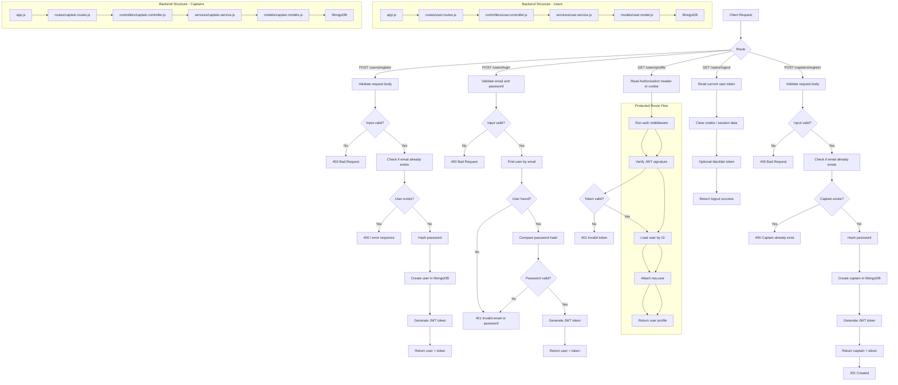

# Backend API Documentation

## User Registration Endpoint

This backend exposes the user registration endpoint at:

- POST /users/register

> Note: In the application code, the router is mounted under `/users`, and the route file defines `/register`. So the complete endpoint is `/users/register`.

### Description

Creates a new user account with a first name, last name, email, and password. The request is validated before saving the user. If valid, the server stores the user and returns a JWT token.

### Request Method

`POST`

### Required Request Body

The request body must be a JSON object in the following format:

```json
{
  "fullname": {
    "firstname": "John",
    "lastname": "Doe"
  },
  "email": "john@example.com",
  "password": "secret123"
}
```


### Validation Rules

- `fullname.firstname`: required, minimum 2 characters
- `fullname.lastname`: required, minimum 2 characters
- `email`: required, must be a valid email address
- `password`: required, minimum 6 characters


### Example Request

```bash
curl -X POST http://localhost:4000/users/register \
  -H "Content-Type: application/json" \
  -d '{
    "fullname": {
      "firstname": "John",
      "lastname": "Doe"
    },
    "email": "john@example.com",
    "password": "secret123"
  }'
```


### Success Response


#### Status Code

`201 Created`

#### Response Body

```json
{
  "user": {
    "_id": "64a7b2d9f1c2d3e4f5a6b7c8",
    "fullname": {
      "firstname": "John",
      "lastname": "Doe"
    },
    "email": "john@example.com"
  },
  "token": "eyJhbGciOiJIUzI1NiIsInR5cCI6IkpXVCJ9..."
}
```


### Validation Error Response


#### Status Code

`400 Bad Request`

#### Response Body

```json
{
  "errors": [
    {
      "msg": "First name must be at least 2 characters long",
      "param": "fullname.firstname",
      "location": "body"
    }
  ]
}
```


### Status Codes Summary

- `201` - User successfully created
- `400` - Invalid input or validation failed
- `500` - Server error while creating the user


### Notes

- The password is hashed before being saved to the database.
- A JWT token is generated for the newly created user.
- The endpoint requires JSON data in the request body.

---


## User Login Endpoint

This backend exposes the user login endpoint at:

- POST /users/login

> Note: The router is mounted under `/users`, and the route file defines `/login`. So the complete endpoint is `/users/login`.


### Description

Authenticates an existing user by checking the email and password. If valid, the server returns the user details and a JWT token.

### Request Method

`POST`

### Required Request Body

The request body must be a JSON object in the following format:

```json
{
  "email": "john@example.com",
  "password": "secret123"
}
```


### Validation Rules

- `email`: required, must be a valid email address
- `password`: required, minimum 6 characters


### Example Request

```bash
curl -X POST http://localhost:4000/users/login \
  -H "Content-Type: application/json" \
  -d '{
    "email": "john@example.com",
    "password": "secret123"
  }'
```


### Success Response


#### Status Code

`200 OK`

#### Response Body

```json
{
  "user": {
    "_id": "64a7b2d9f1c2d3e4f5a6b7c8",
    "fullname": {
      "firstname": "John",
      "lastname": "Doe"
    },
    "email": "john@example.com"
  },
  "token": "eyJhbGciOiJIUzI1NiIsInR5cCI6IkpXVCJ9..."
}
```


### Validation Error Response


#### Status Code

`400 Bad Request`

#### Response Body

```json
{
  "errors": [
    {
      "msg": "Invalid email address",
      "param": "email",
      "location": "body"
    }
  ]
}
```


### Unauthorized Response


#### Status Code

`401 Unauthorized`

#### Response Body

```json
{
  "message": "Invalid email or password"
}
```


### Status Codes Summary

- `200` - User logged in successfully
- `400` - Invalid input or validation failed
- `401` - Invalid email or password
- `500` - Server error while logging in


### Notes

- The login endpoint verifies user credentials before issuing a JWT.
- The JWT is used for authenticated future requests.
- The endpoint accepts JSON data in the request body.

---


## Backend Route Flow Overview

This diagram shows the full flow for all main user and captain routes in the backend.




### Route Summary


| Route             | Method | Purpose                                       | Auth Required |
| ----------------- | ------ | --------------------------------------------- | ------------- |
| `/users/register` | POST   | Create a new user account                     | No            |
| `/users/login`    | POST   | Log in a user and return JWT                  | No            |
| `/users/profile`  | GET    | Fetch logged-in user profile                  | Yes           |
| `/users/logout`   | GET    | Log the user out and clean session/token data | Yes           |


### Main Request Flow

```text
Client
  -> app.js
  -> routes/user.routes.js
  -> controllers/user.controller.js
  -> services/user.service.js
  -> models/user.model.js
  -> MongoDB
  -> response payload / JWT token
```


### Protected Route Security Flow

```text
Request
  -> Authorization Header or Cookie
  -> authUser middleware
  -> JWT verification
  -> req.user attached
  -> controller executes protected logic
```

---


## Captain Registration Endpoint

This backend exposes the captain registration endpoint at:

- POST /captains/register

> Note: In the application code, the router is mounted under `/captains`, and the route file defines `/register`. So the complete endpoint is `/captains/register`.


### Description

Creates a new captain account with personal details and vehicle information. The request is validated before saving the captain. If valid, the server stores the captain and returns a JWT token.

### Request Method

`POST`

### Required Request Body

The request body must be a JSON object in the following format:

```json
{
  "fullname": {
    "firstname": "Rajesh",
    "lastname": "Kumar"
  },
  "email": "rajesh.captain@example.com",
  "password": "Captain@123",
  "vehicle": {
    "color": "Black",
    "numberplate": "MH02AB1234",
    "capacity": 4,
    "vehicalType": "car"
  }
}
```


### Validation Rules

- `fullname.firstname`: required, minimum 3 characters
- `fullname.lastname`: optional, minimum 2 characters
- `email`: required, must be a valid email address
- `password`: required, minimum 6 characters
- `vehicle.color`: required, minimum 3 characters
- `vehicle.numberplate`: required, minimum 4 characters
- `vehicle.capacity`: required, must be an integer ≥ 1
- `vehicle.vehicalType`: required, must be one of: `car`, `bike`, `van`, `auto`


### Example Request

```bash
curl -X POST http://localhost:4000/captains/register \
  -H "Content-Type: application/json" \
  -d '{
    "fullname": {
      "firstname": "Rajesh",
      "lastname": "Kumar"
    },
    "email": "rajesh.captain@example.com",
    "password": "Captain@123",
    "vehicle": {
      "color": "Black",
      "numberplate": "MH02AB1234",
      "capacity": 4,
      "vehicalType": "car"
    }
  }'
```


### Success Response


#### Status Code

`201 Created`

#### Response Body

```json
{
  "captain": {
    "_id": "64a7b2d9f1c2d3e4f5a6b7c9",
    "fullname": {
      "firstname": "Rajesh",
      "lastname": "Kumar"
    },
    "email": "rajesh.captain@example.com",
    "vehicle": {
      "color": "Black",
      "numberplate": "MH02AB1234",
      "capacity": 4,
      "vehicalType": "car"
    },
    "status": "active"
  },
  "token": "eyJhbGciOiJIUzI1NiIsInR5cCI6IkpXVCJ9..."
}
```


### Validation Error Response


#### Status Code

`400 Bad Request`

#### Response Body

```json
{
  "errors": [
    {
      "msg": "Name is required",
      "param": "fullname.firstname",
      "location": "body"
    },
    {
      "msg": "Valid email is required",
      "param": "email",
      "location": "body"
    }
  ]
}
```


### Duplicate Email Response


#### Status Code

`400 Bad Request`

#### Response Body

```json
{
  "message": "Captain already exist"
}
```


### Status Codes Summary

- `201` - Captain successfully created
- `400` - Invalid input, validation failed, or captain already exists
- `500` - Server error while creating the captain


### Notes

- The password is hashed before being saved to the database.
- A JWT token is generated for the newly created captain with 24-hour expiration.
- The endpoint requires JSON data in the request body.
- Captain email must be unique in the system.
- Captain status defaults to "active".
- Vehicle information is required and cannot be left empty.

---


## Captain Login Endpoint

This backend exposes the captain login endpoint at:

- POST /captains/login


### Description

Authenticates an existing captain by email and password. If valid, the server returns the captain details and a JWT token.

### Request Method

`POST`

### Required Request Body

```json
{
  "email": "rajesh.captain@example.com",
  "password": "Captain@123"
}
```


### Validation Rules

- `email`: required, must be a valid email address
- `password`: required, minimum 6 characters


### Example Request

```bash
curl -X POST http://localhost:4000/captains/login \
  -H "Content-Type: application/json" \
  -d '{
    "email": "rajesh.captain@example.com",
    "password": "Captain@123"
  }'
```


### Success Response

**Status Code:** `200 OK`

```json
{
  "token": "eyJhbGciOiJIUzI1NiIsInR5cCI6IkpXVCJ9...",
  "captain": {
    "_id": "64a7b2d9f1c2d3e4f5a6b7c9",
    "fullname": {
      "firstname": "Rajesh",
      "lastname": "Kumar"
    },
    "email": "rajesh.captain@example.com",
    "vehicle": {
      "color": "Black",
      "numberplate": "MH02AB1234",
      "capacity": 4,
      "vehicalType": "car"
    },
    "status": "active"
  }
}
```


### Status Codes Summary

- `200` - Login successful
- `400` - Validation failed
- `401` - Invalid email or password
- `500` - Server error

---


## Captain Profile Endpoint

This backend exposes the captain profile endpoint at:

- GET /captains/profile


### Description

Fetches the logged-in captain's profile. Requires authentication via the `authCaptain` middleware.

### Authentication

```http
Authorization: Bearer <jwt_token>
```

Or via cookie:

```http
Cookie: token=<jwt_token>
```


### Example Request

```bash
curl http://localhost:4000/captains/profile \
  -H "Authorization: Bearer <jwt_token>"
```


### Success Response

**Status Code:** `200 OK`

```json
{
  "captain": {
    "_id": "64a7b2d9f1c2d3e4f5a6b7c9",
    "fullname": {
      "firstname": "Rajesh",
      "lastname": "Kumar"
    },
    "email": "rajesh.captain@example.com",
    "vehicle": {
      "color": "Black",
      "numberplate": "MH02AB1234",
      "capacity": 4,
      "vehicalType": "car"
    },
    "status": "active"
  }
}
```


### Status Codes Summary

- `200` - Profile fetched successfully
- `401` - Missing, invalid, or blacklisted token

---


## Captain Logout Endpoint

This backend exposes the captain logout endpoint at:

- GET /captains/logout


### Description

Logs out the captain, clears the session cookie, and blacklists the JWT token.

### Authentication

```http
Authorization: Bearer <jwt_token>
```


### Example Request

```bash
curl http://localhost:4000/captains/logout \
  -H "Authorization: Bearer <jwt_token>"
```


### Success Response

**Status Code:** `200 OK`

```json
{
  "message": "Logged out successfully"
}
```


### Status Codes Summary

- `200` - Logout successful
- `401` - Missing, invalid, or blacklisted token

---


## Vehicle Types

The following vehicle types are supported for captains:


| Type | Description        |
| ---- | ------------------ |
| car  | Standard car       |
| bike | Motorcycle/Scooter |
| van  | Van/Large vehicle  |
| auto | Auto-rickshaw      |


### Route Summary 


| Route                | Method | Purpose                                       | Auth Required |
| -------------------- | ------ | --------------------------------------------- | ------------- |
| `/users/register`    | POST   | Create a new user account                     | No            |
| `/users/login`       | POST   | Log in a user and return JWT                  | No            |
| `/users/profile`     | GET    | Fetch logged-in user profile                  | Yes           |
| `/users/logout`      | GET    | Log the user out and clean session/token data | Yes           |
| `/captains/register` | POST   | Create a new captain account                  | No            |
| `/captains/login`    | POST   | Log in a captain and return JWT               | No            |
| `/captains/profile`  | GET    | Fetch logged-in captain profile               | Yes           |
| `/captains/logout`   | GET    | Log the captain out and blacklist token       | Yes           |


> Note: For full captain API documentation, see [CAPTAIN_API.md](CAPTAIN_API.md). 